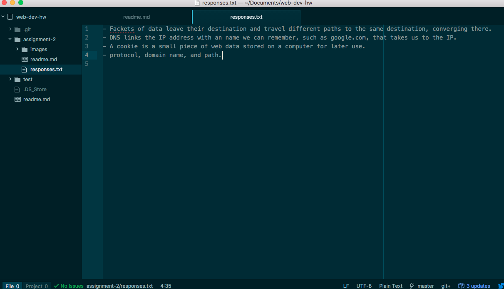

# Assignment 2

Version control system logs all of your previous drafts of a project. This means that if I mess up a new draft and cannot fix it, I can go back to a previously pushed draft and work from there. Every time I save, I can make a new version to place on github.

[responses.txt](./responses.txt)

## Work Summary

In this week's assignment, I worked on making a repo and pushing it to github along with some files. I had problems with pushing it to github because I didn't know where to put my summary of commits, and I was putting those into the description box. I have done this before but I used sourcetree instead of github and it was confusing to do it a new way.

