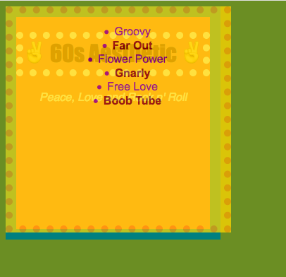

# Assignment 6

I chose to do the 60's for this assignment.
My color scheme was based off of palettes I found when I researched 60's trends.

My palette included:
- darkturquoise
- teal
- orange
- maroon
- tomato
- darkmagenta

I know that was a lot of colors, and the result is pretty ugly, but I had fun figuring it out. I'm not proud of the physical appearance at all but it was cool to see what I can do.

Here's a screenshot of when I accidentally stacked all of my divs on top of one another.
