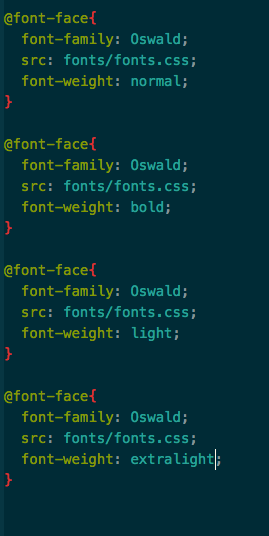

# Assignment 7

I chose Oswald and Titan one because they're cute fonts, and I remember Wayside school books as being very cute and weird.

Web safe fonts are installed on almost all devices and should show up safely. Web fonts are used on the internet and show up in most browsers. System fonts are on computers, with Windows and Mac having some different fonts. Backup fonts are important in case a font is not web safe for a certain computer.

This work cycle wasn't too hard for me, but I did make multiple mistakes along the way. I think I've fixed them.

