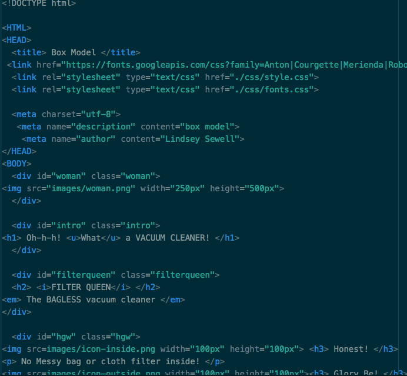

# Box Model

Padding is the space between the content and the border, margins are the space between the box and other elements. Borders are the outside lines that define a box.

Overlapping areas and formatting were hardest for me. I'm still not sure that I did it entirely correctly, but it looks right for the most part.

This was a really hard assignment for me. I felt at times like I wasn't going to be able to complete it, but I did. I'm fairly satisfied with the results, but I know there will be lots of assignments better than mine.

