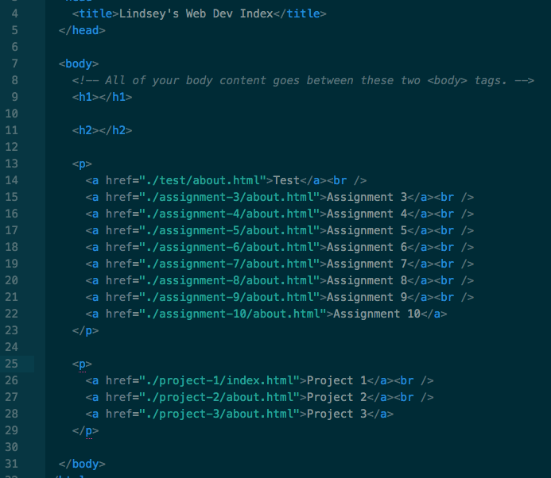

# Project 1 Readme

I use a few browsers to surf:

- Firefox
- Safari
- Chrome

Browsers work by contacting servers and reading html to display images, animations, text and more.

On the Wayback machine, I went to Google in the year 2000. It was very simplistic in terms of design, and it was weird seeing the old rendered logo with a drop shadow compared to the one we have now.

During this work cycle, I had a few issues with linking in my index. I was able to make it work, but I feel like I lack some understanding. I liked learning about how to publish my own site and look forward to continuing in the future.

### Here is a screenshot of my index in progress:

