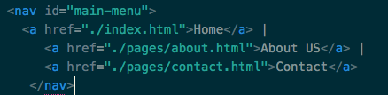
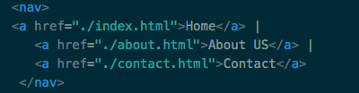
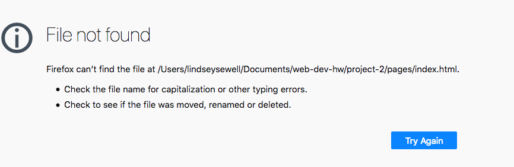

# Project 2:
## The struggle

This project was very hard for me but it turned out to be a lot of fun. I really like HTML, but I still have to reference our learning material sometimes to recall what I'm supposed to be doing.

I am excited to learn to decorate with css. I love graphic design and pretty web interfaces and I look forward to doing more than just coloring a background and some text.

This work cycle was difficult for me. I've been working for many hours over the course of a few days and it was pretty hard to figure out what I'm doing. I had some issues with navigation as shown in the below screenshots:

Inline-style:

I did enjoy the project, but I'm ready for spring break.
